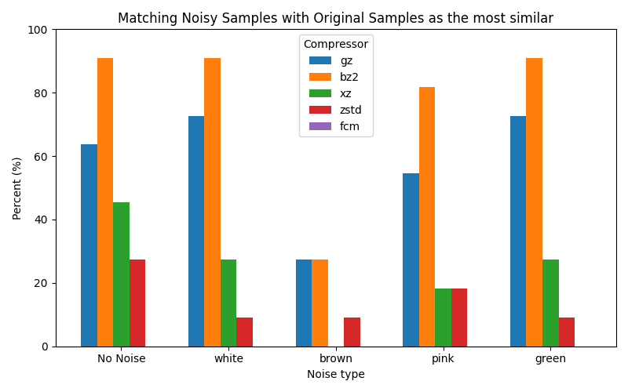
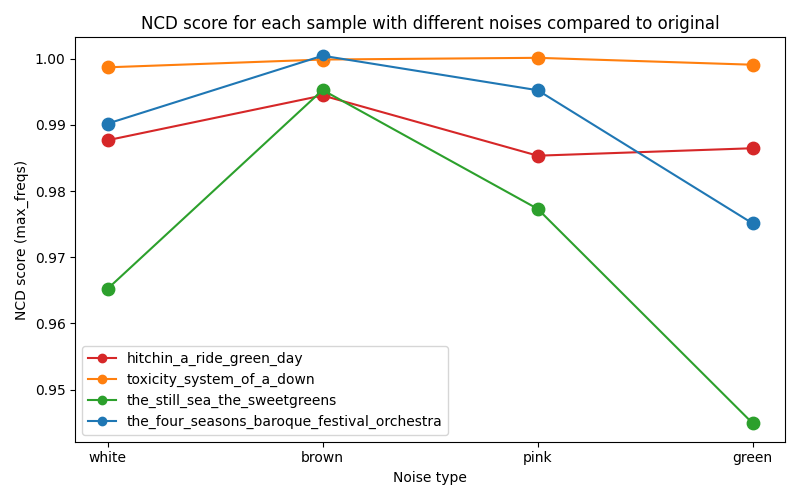
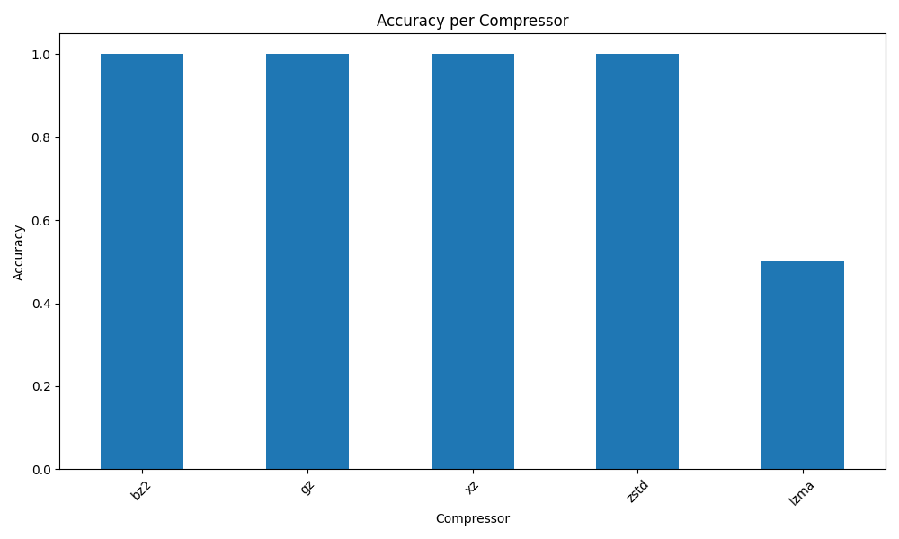

# Projects for the class of TAI 2024/2025

## Table of Contents
- [First Project](#first-project)
  - [Dependencies](#dependencies)
  - [Compile and Executing](#compile-and-executing)
    - [Compile the project](#compile-the-project)
    - [Run fcm](#run-fcm)
    - [Run generator](#run-generator)
    - [Run chart generator](#run-chart-generator)
    - [Examples](#examples)
  - [Important notes](#important-notes)
- [Second Project](#second-project)
  - [Dependencies](#dependencies-1)
  - [Executables](#executables)
  - [Compiling and executing](#compiling-and-executing)
  - [Important Notes](#important-notes-1)
- [Third Project](#third-project)
  - [Implementation](#implementation)
    - [Audio Feature Extraction](#1-audio-feature-extraction)
    - [Frequency Flattening](#2-frequency-flattening)
    - [Compression and NCD Calculation](#3-compression-and-ncd-calculation)
    - [Music Matching](#4-music-matching)
  - [Experimental Analysis](#experimental-analysis)
    - [Data used](#data-used)
    - [Experiment with noisy samples](#experiment-with-noisy-samples)
      - [Experiment the effect of noisy on NCD values](#experiment-the-effect-of-noisy-on-ncd-values)
    - [Experiment with different compressors and different sizes of samples](#experiment-with-different-compressors-and-different-sizes-of-samples)
    - [Experiment with images](#experiment-with-images)
    - [Experiment with FCM](#experiment-with-fcm)
  - [Important Notes](#important-notes-2)
  - [Compilation and Execution](#compilation-and-execution)
- [Authors](#authors)

---

## First Project

This project consists on the development of two main components:

- **fcm**: a program that measures the information content of text provided using a learned finite-context model
- **generator**: a text generator that creates text following depending on a model created
Both programs read a text file and train a finite-context model before execution of their main
roles.

### Dependencies

- argparse, version 0.2.2
- plotters, version 0.3.7
- rand , version 0.9.0

##### Rust
Rust and Cargo need to be installed.
```bash
curl --proto '=https' --tlsv1.2 -sSf https://sh.rustup.rs | sh
```

### Compile and Executing

#### Compile the project
To compile the project, you need to run the following command at the root of the project:
```bash
cargo build
```
After this, executables will be available in the `target/debug` folder.

#### Run fcm
At the root of the project, run:
```bash
target/debug/fcm {file} -k {k} -a {a}
```

With the following arguments:
- `file`: the path to the file .txt with the data to train the model
- `k`: the context size: the number of characters to consider before the current character
- `a`: the smoothing parameter: the value to add to the counts to avoid zero probabilities

#### Run generator
At the root of the project, run:
```bash
target/debug/generator {file} -k {k} -a {a} -p {p} -s {s} -m {mode}
```

With the following arguments:
- `file`: the path to the file .txt with the data to train the model
- `k`: the context size: the number of characters to consider before the current character
- `a`: the smoothing parameter: the value to add to the counts to avoid zero probabilities
- `p`: the first characters of the generated text
- `s`: the number of characters to generate
- `m`: the mode that generator use the default is `normal` that uses chars as tokens the other mode is `words` that use words as tokens

#### Run chart generator
At the root of the project, run:
```bash
target/debug/chart_generator {file} -a {a} -o {output_file}
```

With the following arguments:
- `file`: the path to the file .txt with the data to train the model
- `a`: the smoothing parameter: the value to add to the counts to avoid zero probabilities
- `output_file`: the path to the output file to save the chart it must end with .png

#### Examples
Some bash scripts are available in the `examples` folder to run the programs with some examples.

### Important notes

- The report can be found in this [location](/docs/assignment_1/report_107162_108840_109018.pdf).
- All the visualizations created for this project are in the [visualizations folder](/visualizations/).

---

## Second Project

In this project, we explore the potential to identify the types of organisms present in a metagenomic sample by comparing their similarity to multiple known reference sequences. To achieve this, we use Normalized Relative Compression (NRC) with a finite-context model. The implementation follows a methodology that compares one sample against multiple references in a database file. The tool begins by training a finite-context model using the sample, and then computes the NRC value for each sequence of DNA in the database. Based on these values, we rank the top candidate matches the sample.

### Dependencies

- Rust, Cargo and [OpenCV](https://opencv.org/get-started/) need to be installed.

```bash
curl --proto '=https' --tlsv1.2 -sSf https://sh.rustup.rs | sh
```

- argparse, version 0.2.2
- plotters, version 0.3.7
- rand, version 0.9.0
- serde, version 1.0 and an additional feature called derive
- serde_json, version 1.0.139
- bson, version 2.0
- opencv, version 0.94.4
- regex, version 1.11.1
- Python 3.8 or higher
- Python libraries: `numpy`, `pandas`, `matplotlib`, `seaborn`, `plotly`, `plotly.express` (at requirements.txt)
- Rust libraries: `serde`, `serde_json`, `bson`, `opencv`, `hound`, `regex` (at Cargo.toml)

### Executables

There is one Bash script in this [location](/scripts/bash/run_meta.sh). To execute it follow these commands:

```bash
cd scripts/bash/
chmod +x run_meta.sh
./run_meta.sh
```

The script builds and runs the metaClass program using the following example arguments:

- db.txt
- meta.txt
- k = 10
- alpha = 0.01

### Compiling and executing

To compile the project, you need to run the following command at the root of the project:
```bash
cargo build
```
After this, executables will be available in the `target/debug` folder.
To run the metaClass program, you need to run the following command at the root of the project:
```bash
target/debug/metaClass -d {db_file} -s {meta_file} -k {k} -a {alpha}
```

The following arguments can/need to be passed:
```bash
Usage:
  ./target/debug/metaClass [OPTIONS]

Algorithmic Theory of Information Second Project

Optional arguments:
  -h,--help             Show this help message and exit
  -s   Path to the meta file (required)
  -d   Path to the database file (required)
  -k   Size of the sliding window (default: 3, must be 1 <= k <= 100)
  -a   Smoothing parameter (default: 0.01, must be 0 <= alpha <= 1)
  -t   Number of top sequences to display (default: 20, must be 1 <= top_sequences <= 239)
  -l   Threshold for low scores (default: 0.5, must be 0 <= low_score <= 1)
```

### Important Notes

- The report can be found in this [location](/docs/assignment_2/TAI_Report_2.pdf).
- The demo for the project can be found in this [location](/docs/assignment_2/tai_demo_2nd_assignment.mp4).
- All the visualizations created for this project are in the [visualizations folder](/visualizations/).

---

## Third Project

This project explores the use of Normalized Compression Distance (NCD) for automatic music identification. The main goal is to identify music samples by comparing them to a database of full music tracks using general-purpose compression algorithms such as **gzip**, **bzip2**, **zstd** and **lzma**. The method relies on approximating algorithmic information distance through compression, with the objective of finding the music in the database most similar to a given sample. Additional testing includes the use of noisy samples to evaluate the robustness of our approach.

### Implementation

The implementation is organized into several core components:

#### 1. Audio Feature Extraction

The `audio_reader.rs` module extracts the most signficant frequencies from `.wav` files. Each audio is divided into overlapping segments (like with 1 second windows), and for each segment, a Fast Fourier Transform (FFT) is applied to extract the top-N dominant and least dominant frequencies. This results in a time-series "signature" of frequency values for each audio file.

#### 2. Frequency Flattening

These frequency vectors are then flattened into space-separated strings to prepare them for compression based comparison. This string representation is used to simulate a text-based representation of the audio data that compression algorithms can process.

#### 3. Compression and NCD Calculation

The `compressors.rs` module provides wrappers around standard compressors like **gzip**, **bzip2**, **zstd**, and **lzma** to calculate the compressed size of a frequency string. Using these sizes, `ncd.rs` computes the NCD using the formula:
```mathematica
NCD(x, y) = (C(xy) - min(C(x), C(y))) / max(C(x), C(y))
```

This is done for both dominant and least dominant frequency strings allowing comparison on multiple aspects of the audio.
An alternative method is also supported using a Finite Context Model (FCM), where the information content of each string is computed based on a trained probabilistic model, instead of using external compressors.

#### 4. Music Matching

In `audio.rs`, the system reads a sample `.wav` file and compares it against all `.wav` files in a specified music database. It computes the NCD between the sample and each music track and ranks them by similarity (lowest NCD first). The top-K closest matches are displayed for both dominant and least dominant frequencies.

### Experimental Analysis

#### Data used

In terms of data, our experiments utilized a collection of `.wav` files from various music genres, including pop, punk-rock, hard-rock, grunge, rap, fado, pimba, classical, and jazz. In total, 30 music tracks were used and are available in the [music folder](./music/). 
Brown, Pink, Green and White noise were also used to test the robustness of the approach against noisy samples.

#### Experiment with noisy samples

Original music tracks were used to manually create 20-second audio samples, in Audacity. The musics were selected to cover a diverse range of musical styles, ensuring that at least one sample represented each genre. For each selected song, the following variants were created:
- Clean sample (no added noise)
- White noise
- Pink noise
- Brown noise
- Green noise

For each of the samples created, the NCD was calculated between the sample and a reference dataset containing all the original songs, with the goal to determine if the system could correctly identify the most similar track. This procedure was repeated for the compression algorithms *gzip*, *bzip2*, *xz*, *zstd* and *fcm*.



The bar chart shows the percentage of cases in which the most similar sample identified by the NCD-based method corresponded to the original source, across different types of added noise and grouped by compression algorithm.

##### Experiment the effect of noisy on NCD values

A separate test was conducted to investigate whether the loudness of the original music influenced the effect of added noise on the NCD score. The hypothesis was that quieter songs might be more affected by added noise, as the noise becomes more perceptible relative to the audio signal. For this, four songs were selected

**Louder tracks**

- "hitchin_a_ride_green_day" (red)
- "toxicity_system_of_a_down" (orange)

**Quieter tracks**
- "the_still_sea_the_sweetgreens" (green)
- "the_four_seasons_baroque_festival_orchestra" (blue)

The figure below shows the NCD scores for each song across the noise types.



The results do not show a clear distinction between loud and quiet tracks (for example, the blue and green lines - quieter songs - do not consistently have higher NCD scores than the red and orange lines - louder songs. So, no conclusive evidence was found that louder or quieter tracks are more or less affected by noise in terms of NCD similarity.

#### Experiment with different compressors and different sizes of samples

For this experiment our group decided to execute our solution, where the samples were created based on all of the available songs, but with different sizes. This means that for each song 3 samples were created, one with 20s, another with 40s and the last one with 60s. Then with for each sample created we used all the compressors available, meaning that for each sample created, the program was executed 5 times one for each compressor (**gzip**, **bzip2**, **zstd**, **xz** and **lzma**). In total our program executed 450 times, 15 times per sample.
The results obtained can be seen throuhg the following image:



Where it is possible to observe that the compressors **gzip**, **bzip2**, **zstd** and **xz** manage to always find the most similar song being the song from where the sample was generated. However for the compressor **lzma**, it did not have a good accuracy rate, he can see that he manage to find the correct most similiar song on **50%** of the samples, where in the other half it failed.

#### Experiment with images

As we had already experimented with images in our previous work, we decided to extend this approach by applying NCD (Normalized Compression Distance) using various compressors. We used the same dataset as in the second experiment, which contains 41 subjects, each with 10 grayscale images. For each subject, we selected the first image and compared it to all images in the dataset using NCD with multiple compressors: **gzip**, **bzip2**, **zstd**, **xz**, and **lzma**. The images were loaded in grayscale using OpenCV and preprocessed with quantization. For each comparison, we compressed both individual images and their concatenation, then computed the NCD. To be considered a correct match, the top 10 closest images (based on NCD) must all belong to the same subject. Since there are 41 subjects and each should yield 10 correct matches, the maximum score for each compressor is 410.

| Image | gz | bz2 | xz | zstd | lzma |
|--------|------|------|------|------|------|
| 1_1.jpg | 7 | 10 | 3 | 7 | 2 |
| 11_2.jpg | 7 | 9 | 4 | 7 | 8 |
| 21_3.jpg | 7 | 4 | 6 | 7 | 5 |
| 31_4.jpg | 4 | 6 | 2 | 3 | 1 |
| 41_5.jpg | 4 | 5 | 4 | 5 | 5 |
| 51_6.jpg | 3 | 7 | 3 | 4 | 3 |
| 61_7.jpg | 6 | 7 | 4 | 7 | 6 |
| 71_8.jpg | 9 | 4 | 1 | 4 | 1 |
| 81_9.jpg | 5 | 5 | 2 | 4 | 3 |
| 91_10.jpg | 7 | 5 | 4 | 8 | 3 |
| 101_11.jpg | 8 | 6 | 4 | 7 | 7 |
| 111_12.jpg | 8 | 4 | 2 | 5 | 0 |
| 121_13.jpg | 2 | 6 | 1 | 3 | 0 |
| 131_14.jpg | 7 | 8 | 4 | 5 | 2 |
| 141_15.jpg | 2 | 4 | 3 | 2 | 2 |
| 151_16.jpg | 1 | 2 | 1 | 1 | 1 |
| 161_17.jpg | 5 | 5 | 3 | 4 | 5 |
| 171_18.jpg | 5 | 4 | 2 | 6 | 1 |
| 181_19.jpg | 5 | 10 | 3 | 6 | 1 |
| 191_20.jpg | 4 | 4 | 2 | 2 | 1 |
| 201_21.jpg | 5 | 4 | 2 | 2 | 2 |
| 211_22.jpg | 5 | 5 | 9 | 5 | 6 |
| 221_23.jpg | 5 | 6 | 4 | 5 | 3 |
| 231_24.jpg | 4 | 6 | 3 | 5 | 4 |
| 241_25.jpg | 3 | 5 | 2 | 4 | 2 |
| 251_26.jpg | 2 | 6 | 3 | 2 | 0 |
| 261_27.jpg | 4 | 7 | 1 | 5 | 9 |
| 271_28.jpg | 5 | 4 | 4 | 2 | 2 |
| 281_29.jpg | 5 | 5 | 5 | 4 | 4 |
| 291_30.jpg | 4 | 7 | 6 | 3 | 7 |
| 301_31.jpg | 3 | 3 | 2 | 2 | 5 |
| 311_32.jpg | 9 | 4 | 6 | 7 | 4 |
| 321_33.jpg | 5 | 6 | 5 | 5 | 4 |
| 331_34.jpg | 8 | 7 | 3 | 6 | 2 |
| 341_35.jpg | 6 | 3 | 4 | 4 | 2 |
| 351_36.jpg | 2 | 2 | 1 | 2 | 1 |
| 361_37.jpg | 3 | 5 | 1 | 2 | 0 |
| 371_38.jpg | 6 | 5 | 1 | 5 | 4 |
| 381_39.jpg | 7 | 4 | 1 | 4 | 1 |
| 391_40.jpg | 4 | 7 | 4 | 5 | 3 |
| 401_41.jpg | 7 | 10 | 1 | 3 | 1 |
| **Total** | 208 | 226 | 126 | 179 | 123 |

The table below presents the results for the various compressors. The best-performing compressor was **bzip2**, achieving an accuracy of 55%.

#### Experiment with FCM

In this project, we attempted to use the FCM (Finite Context Model) approach from the two previous works, but without success. Initially, we tried training the model with the image or music sample we wanted to compare against the database, and then used it to compress X (the query image/music), Y (an item from the database), and XY (the concatenation of X and Y). However, this approach did not yield good results. We then tried creating separate models for each of X, Y, and XY, but that also failed to produce satisfactory results.

### Important Notes

- The document relative to the project can be found in this [location](/docs/assignment3/trab3.pdf).
- The poster developed for the project that describes our solution can be found in this [location](/docs/assignment3/TAI_Poster_3rd_Project.pdf)


### Compilation and Execution

To compile the project, you need to run the following command at the root of the project:
```bash
cargo build --release
```
After this, executables will be available in the `target/release` folder. We suggest compiling with the flag `--release` to optimize the performance of the program, as it can be quite slow otherwise.
To run the main program for this project, you need to run the following command at the root of the project:

```bash
./target/release/metaClass -d {db_directory} -s {sample_audio_file} --start {start_time} --end {end_time}
```

The following arguments can/need to be passed:
```bash
Usage:
  ./target/release/audio [OPTIONS]

Algorithmic Theory of Information Third Project

Optional arguments:
  -h,--help      Show this help message and exit
  -s             Path to the sample music file (it must be a .wav file and it is required to be passed) 
  -d             Path to the directory containing music files (all the musics must be .wav files and it is required to be passed)
  -l             Segment length in milliseconds (default: 500ms)
  -n             Top N frequencies to extract (default: 10)
  -k             Top K closest music files to the sample (default: 4)
  -c             Compressor to use (gz, bz2, xz, zstd, lzma) (default: gz)
  --start START  Start time (in milliseconds) of the sample segment (required)
  --end END      End time (in milliseconds) of the sample segment (required)
```

## Authors

| Author | Percentage |
| :--: | :--: |
| Guilherme Amorim | 1/3 |
| José Gameiro | 1/3 |
| Tomás Victal | 1/3 |